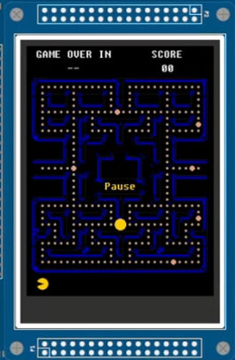

# 🕹️ ARM-PACMAN

**ARM-PACMAN** is a minimalist, half-featured Pac-Man clone developed for the **ARM Cortex-M3 (v7)** architecture using the **Langtuger development board**. Written in **C (90%)** and **ARM Assembly (10%)**, this project demonstrates game development in a bare-metal embedded system with real-time joystick input and interrupt handling.

> ⚠️ Note: To build and run this project, you must install the [Keil MDK ARM Development Environment](https://www.keil.com/demo/eval/arm.htm). The project does not include `.uvprojx` files; you will create a new project and import the provided source code.

---

## 📸 Screenshot



---

## 🎯 Features & Game Specs

| Spec | Description |
|------|-------------|
| 🟡 **240 Standard Pills** | The labyrinth is filled with 240 collectible pills. |
| 🔵 **6 Power Pills** | Appear randomly in time and position, replacing standard pills. |
| 🎮 **Joystick Movement** | Pac-Man moves in a chosen direction until a wall or new input. |
| 🔁 **Teleport Zones** | Crossing teleport zones preserves direction, exiting on the opposite side. |
| 🍬 **Scoring System** | +10 points per Standard Pill, +50 for Power Pills. |
| ❤️ **Lives System** | +1 life for every 1000 points (starts with 1 life). |
| ⏸️ **Pause Functionality (INT0)** | Pressing INT0 toggles pause mode (starts paused). |
| ⏳ **Countdown Timer** | Game starts at 60 seconds and ends at 0. |
| 🏆 **Win Condition** | All pills collected = Victory screen. |
| ❌ **Loss Condition** | Timer reaches 0 before all pills = Game Over. |
| 👻 **No Ghosts (Yet)** | Ghost mechanics are not implemented. |

---

## 🧠 Technical Highlights

- **Low-level game logic** for Cortex-M3 bare-metal environment
- **Joystick input** handled via GPIO
- **Interrupt-driven pause/resume** via INT0 (external interrupt)
- **Pseudo-random number generation** for pill logic
- **Direct memory-mapped I/O** for rendering and input handling

---

## 🛠️ Setup & Usage

### Requirements

- [✅ Keil MDK ARM](https://www.keil.com/demo/eval/arm.htm)
- ✅ ARM Cortex-M3v7 Langtuger board (or compatible)
- ✅ Joystick + display support (GPIO & UART/display capable)

### Installation Steps

1. **Install Keil MDK ARM** from the official site.

2. **Clone or download this repository**
   ```bash
   git clone https://github.com/virtsudo/ARM-PACMAN.git
